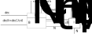

The large earth system models are formulated as discrete time step models.
If the time steps are long, large fluxes change the pool in a single step,
such that the computed rate at the beginning of the time step is not
representative any more.

Here, we explore, how an adjustment of the rate 
parameters can be used to approximate the real behaviour during that
time.

```{r, echo=FALSE, results='hide', message=FALSE}
library(ggplot2)
library(grid)   #unit
library(RColorBrewer) # brewer.pal
library(tidyr)
library(dplyr)
library(purrr)
library(tibble)
library(deSolve)

myColors <- brewer.pal(5,"Dark2")	
.simpleCap <- function(s) {
    paste(toupper(substring(s, 1, 1)), substring(s, 2),  sep = "")
}
colScale <- scale_colour_manual(name = "Variant",values = myColors)
.treatments <- structure(c(1,0.5), names = c("Litter input pulse","No Litter input"))
sizeScale <- scale_size_manual(name = "Treatment",values = .treatments)

#themeDefault <- theme_classic()  
themeDefault <- theme_bw()  
```

# Simulate a first order decay

We simulate a simple first order decay with output at times 0,1,...
The model is
$$
{dx \over dt} = -k \, x(t) + i
$$
with amount $x$ (e.g. unit mol nitrogen) changing with time $t$ (e.g. unit day)
with a first-order output flux and an
input flux which is independent of $x$. The input flux can depend on $t$ but
for the derivation here, is assumed that the change within one time step
is small.

A model function that complies with the deSolve::ode requirements is:

```{r}
deriv <- function(t, x, parms){ list(
  dx = c(x = -parms$k*x + parms$i),
  output = c(decomp = -parms$k*x)
  )}
```

This simple model has the analytic solution
$$
x(t) = \left(x_0 - {i \over k}\right)e^{-k t} + {i \over k}
$$
```{r}
fAnalytic <- function(x0,times,k,i) (x0 - i/k)*exp(-k*times) + (i/k)
```

Such a model should be simulated using a solver that can adjust the time
steps depending on the magnitude of changes. However, in many simulators
a discrete time step solver is implemented, similar to the following code.

```{r}
solveDiscrete <- function(y, tout, func, parms, tstep) {
  t <- seq(min(tout),max(tout),by = tstep)
  nstep <- length(t)
  x <- rbind(y, matrix(NA_real_, nrow = nstep, ncol = length(y)))
  outputs_list <- vector("list", nstep)
  for(i in 1:nstep) {
    resFunc <- func(t[i], x[i,], parms)
    x[i+1,] <- x[i,] + resFunc[[1]] * tstep
    outputs_list[[i]] <- resFunc[[2]]
  }
  isOut <- c(t %in% tout)
  outputs_mat <- outputs_list[isOut] %>% bind_rows()
  ans <- cbind(time = t[isOut], x[c(isOut,FALSE),,drop = FALSE], outputs_mat)
  rownames(ans) <- NULL
  ans
}
```

We now look at the simulation results obtained using different time steps
in the solver.

```{r}
tsteps <- c(0.1,0.5,1)
parms <- list(k = 0.9, i = 0.2)
x0 <- c(x = 10)
times <- 0:4
sims <- tsteps %>% map_df(function(tstep){
  tibble(
    solver = "discrete",
    tstep = as.character(tstep),
    t = times,
    x = solveDiscrete(x0, times, deriv, parms = parms, tstep = !!tstep)[,"x"]
  )
})
```

And add the analytic solution.
```{r}
df <- sims %>% bind_rows(tibble(
  solver = "analytic",
  tstep = "analytic",
  t = times,
  x = fAnalytic(x0,times,parms$k, parms$i)
))
```

```{r echo=FALSE}
df %>% ggplot(aes(t,x, color = tstep)) + geom_point() + geom_line() + themeDefault
```
There is a large error in the first time step. Lets demonstrate this.

## Look at first time step
```{r}
df1 <- tibble(
  t = seq(0,1,length.out = 20),
  sim_1 = x0 + deriv(0, x0, parms = parms)[[1]]*t,
  analytic = fAnalytic(x0,t,parms$k, parms$i)
)
df1 %>% pivot_longer(sim_1:analytic,"tstep", values_to = "x") %>% 
  ggplot(aes(t,x, color = tstep)) + geom_line() + themeDefault
```
The problem is that the rate, i.e. the slope, changes with the pool within
the time step.
This numeric problem leads to awkward model adjustments, such as checking that
a negative change within one time step is not larger than the current pool size
or discussions about simulation differences whether microbes or plants uptake from the
same pool.

## Derivation of adjusted rate
Instead of adjusting the model, we suggest a practical solution of
adjusting decay rates in the solver.

We derive an adjusted rate, $k_c$, for the discrete time step 
so that the change within the time step 
is equal to the analytic solution, i.e. that the $x(t_s)$ is the same.

$$
x_{\text{corrected linear}}(t_s) = x_{\text{analytic}}(t_s) 
\\
x_0 + (i-k_c x_0) t_s =  \left(x_0 - {i \over k}\right)e^{-k t_s} + {i \over k}
\\
k_c = {i \over x_0} - {1 \over t_s} \left( {i \over k x_0} - 1\right)
\left( 1 - e^{-k t_s}\right) 
$$

```{r}
correct_rate <- function(k,i,x0,ts) 
  #i/x0 -1/ts*((1 - i/k/x0)*exp(-k*ts) + i/k/x0 -1)
  i/x0 -1/ts*(i/k/x0 - 1)*(1 - exp(-k*ts))
parmsC1 <- within(parms, k <- correct_rate(k, i, x0, 1))
c(parms$k, parmsC1$k)
```
The rate was adjusted from 0.9 to 0.6 so that the prediction after one time
step coincides with the analytic solution.

```{r echo=FALSE}
df1 <- df1 %>% mutate(
  sim_C = x0 + deriv(0, x0, parms = parmsC1)[[1]]*t
)
df1 %>% pivot_longer(sim_1:sim_C,"tstep", values_to = "x") %>% 
  ggplot(aes(t,x, color = tstep)) + geom_line() + themeDefault
```
## Applying the correction in the solver

The correction depends on the current state. Therefore, it needs to be
computed at each time step.
For the simple model, the corrections does not depend on current derivative, 
$dx$, and therefore could be applied in each time step without additional cost.
However, for more complex models (see below) we allow the correction to
depend on uncorrected result of the derivative. 
Therefore, if the correction is applied,
it requires a second evaluation of the derivative, i.e. the model.

The updated solver now takes a function that can adjust the parameters.
After computing the uncorrected derivative, this function is called and
asked to correct the parameters if necessary. The default does not adjust
any parameters.

If the parameters were corrected then the derivative is recomputed with the
adjusted parameters.

```{r}
adjust_parms_identity <- function(parms, x, dx, ts)
  list(is_adjusted = FALSE, parms = parms)
solveDiscreteAdj <- function(y, tout, func, parms, tstep
                             ,f_adjust_parms = adjust_parms_identity) {
  t <- seq(min(tout),max(tout),by = tstep)
  nstep <- length(t)
  x <- rbind(y, matrix(NA_real_, nrow = nstep, ncol = length(y)))
  outputs_list <- vector("list", nstep)
  for(i in 1:nstep) {
    resFunc <- func(t[i], x[i,], parms)
    ans_adjust <- f_adjust_parms(parms, x[i,], resFunc, tstep)
    if (isTRUE(ans_adjust$is_adjusted)){
      resFunc <- func(t[i], x[i,], ans_adjust$parms)
    }
    x[i+1,] <- x[i,] + resFunc[[1]] * tstep
    outputs_list[[i]] <- resFunc[[2]]
  }
  isOut <- c(t %in% tout)
  outputs_mat <- outputs_list[isOut] %>% bind_rows()
  ans <- cbind(time = t[isOut], x[c(isOut,FALSE),,drop = FALSE], outputs_mat)
  rownames(ans) <- NULL
  ans
}

```

For the first order decay model, the correction recomputes the decay rate
based on the current state and the time step. It only corrects if the change 
in $x$ is larger than 20% in order to save computation time.

```{r}
adjust_parms_firstorder <- function(p, x, resDeriv, ts) {
  dx <- resDeriv[[1]]
  if (abs(dx*ts/x) <= 0.2) return(adjust_parms_identity(p,x,dx,ts))
  list(
    is_adjusted = TRUE, 
    parms = within(p, k <- correct_rate(p$k,p$i,x,ts)))
}
tsteps <- c(1,0.5,0.1)
simsAdj <- tsteps %>% map_df(function(tstep){
  tibble(
    solver = "discrete_adjusted",
    tstep = as.character(tstep),
    t = times,
    x = solveDiscreteAdj(x0, times, deriv, parms = parms, tstep = !!tstep
                         ,f_adjust_parms = adjust_parms_firstorder)[,"x"]
  )
})
```

For this simple model this leads to a good solution.
```{r echo=FALSE}
df %>% bind_rows(simsAdj) %>% 
  ggplot(aes(t,x, color = solver, linetype = tstep)) + geom_point() + geom_line() + themeDefault
```

# Strategy for more complex models

The derivation of the adjusted rate is specific for the simple first order
decay model with input. For more complex models, we cannot rely on an
analytic solution to do a similar derivation.

However, many formulations are similar to this simple model where fluxes 
can be lumped into these two parts:

- a flux that is first-order to $x$, and
- a flux that is not directly dependent on $x$.


## Example more complex microbial model

In the following model there are several processes influencing 
the inorganic N pool, $I_N$. There is microbial 
mineralization/immobilization, microbial turnover, plant uptake, 
nitrogen deposition and leaching. 
While N deposition and microbial mineralization are independent of $I_N$ 
and leaching is first order in $I_N$, 
plant uptake and microbial mineralization/immobilization 
are complex formulations of many parameters, inputs, and other pools.

For simplicity in the model does not consider SOM pools and feedback
of microbes to the decomposition flux.
Microbial biomass, $B$, is N-limited if there is not enough nitrogen from
decomposition of organic matter and immobilization of the inorganic $I_N$ pool.



```{r}
deriv_inorg_nitrogen <-function(t, x, p){
  # plant uptake
  uINPlant_pot <- p$kINPlant * x["IN"]
  uINPlant_req <- p$uINPlant # for simplicity
  plant_uptake <- min(uINPlant_pot, uINPlant_req)
  # microbial carbon part
  dec <- p$decS # for simplicity
  tvr <- p$tau * x["B"]
  synBC_C <- p$eps*(dec -tvr) # C available for biomass synthesis
  # microbial nitrogen part
  decN <- dec/p$cnIS
  tvrN <- tvr/p$cnB
  immoNPot <- p$iB * x["IN"]
  synBC_N <- (decN + immoNPot - tvrN)*p$cnB # biomass synthesis constraint by N
  # growth limited either C or N
  synBC <- min(synBC_C, synBC_N) # biomass growth limited by either C or N
  nbal <- decN - synBC/p$cnB - tvrN # imbalance flux by mineral
  minN <- max(0, nbal) # if nbal is positive N is mineralized
  immoN <- max(0, -nbal) # if nbal is negative N is immobilized
  # inorganic N
  depoN <- p$iIN
  leachN <- p$lN * x["IN"]
  # here, we assume for simplicity that all tvr is mineralized
  minNPred <- tvrN
  dIN = depoN + minN +minNPred -leachN -immoN -plant_uptake
  dB = synBC
  # C mineralization
  respGr <- (1 - p$eps)/p$eps * synBC
  respTvr <- tvr
  respOverflow <- dec - dB - respGr - tvr
  resp <- respGr + respTvr + respOverflow
  # check mass balances
  meps <- .Machine$double.eps^(1/2)
  if(abs((dB)  - (p$decS - resp)) > meps)
    stop("mass balance C error")
  if(abs((dB/p$cnB + dIN)  - 
         (p$decS/p$cnIS + depoN - leachN - plant_uptake)) > meps)
    stop("mass balance N error")
  list(
    dx = cbind(B = dB, IN = dIN)[1,],
    cbind(uINPlant_pot = uINPlant_pot, uINPlant_req = uINPlant_req,
          plant_uptake = plant_uptake,
          immoNPot = immoNPot, immoN = immoN,
          minN = minN, minNPred = minNPred,
          leachN = leachN, depoN = depoN,
          synBC = synBC, synBC_C = synBC_C, synBC_N = synBC_N)[1,]
  )
}
```

## Spinup to C-limited steady state

Here, we use the variable-timestep solver from the deSolve package to obtain
an accurate solution. 

```{r}
x0 = c(B = 150, IN = 8) # mol C biomass, mol inorganic N
# time in days
parms <- list(
  kINPlant = 1/10 # maximum plant uptake 10 days turnover time of I
  ,uINPlant = 0.9 # demanded plant uptake
  ,decS = 0.9*10 #uINPlant*cnS same N returned to soil as taken up
  ,eps = 0.6     # microbial carbon use efficiency
  ,tau = 1/20    # microbial turnover time
  ,cnIS = 10     # C/N ratio of litter input
  ,cnB = 8       # C/N ratio of microbial biomass
  #,iB = 1/5 # 2*uINPlant
  ,iB = 0.9      # for demonstrating error in time stepped solution
  ,iIN = x0["IN"]*1/200  # N depostion: magnitude of compensating for leaching
  ,lN = 1/200    # leaching rate  
)
res <- ode(x0, 0:300, deriv_inorg_nitrogen, parms) %>% as.data.frame()
```

The system runs into a steady state, where IN is relatively large, so that 
microbial biomass is C-limited, seen by $synBC = synBC_C < synBC_N$ and an
mineralization/immobilization flux smaller than the potential immobilization.

```{r}
x1 <- unlist(res[nrow(res),1 +seq_along(x0)])
dx <- deriv_inorg_nitrogen(0, x1, parms); dx[[2]]
```

```{r echo=FALSE}
res %>% 
  select(time, B, IN) %>% 
  pivot_longer(-time) %>% 
  ggplot(aes(time, value, col = name)) + geom_line() +
  facet_wrap(~name, scales = "free_y") +
  themeDefault
```

## Simulating increased C input

With increased C input by litter, i.e increased C from decomposition with
same N, the system runs into N limitation, 
seen by $synBC = synBC_N < synBC_C$ and and
mineralization/immobilization equal to the potential immobilization.

```{r}
cnISC = 60 # litter input
parmsCinc <- within(parms, {
  cnIS <- cnISC
  decS <- uINPlant*cnIS #uINPlant*cnS same N returned to soil as taken up
})
res2c <- ode(x1, 0:8, deriv_inorg_nitrogen, parmsCinc) %>% as.data.frame()
x2 <- unlist(res2c[nrow(res2c),1 +seq_along(x0)])
dx <- deriv_inorg_nitrogen(0, x2, parmsCinc); dx[[2]]
```
```{r echo=FALSE}
res2c %>% 
  select(time, IN, B) %>% 
  pivot_longer(-time) %>% 
  ggplot(aes(time, value, color = name)) + geom_line() +
  facet_wrap(~name, scales = "free_y") +
  themeDefault
```

### Time stepped solution without and without rate adjustment

```{r}
resStep1 <- solveDiscreteAdj(x1, 0:8, deriv_inorg_nitrogen, parmsCinc, 
                             tstep = 2) # no rate adjustment
```

The rate adjustment is possible, because the model is formulated 
in a way that all the inorganic fluxes are take into account
a potential flux that depends on $I_N$. We can express the first order rate in 
terms of these fluxes $k = {leach + immo + plantup \over I_N}$ and constant flux
$i = N_{depo} + N_{min}$, based on first computation of the derivative 
with unadjusted rates. With these we compute the corrected decay rate, $k_c$.
Then each of the three fluxes is downscaled by factor $k_c \over k$. 
Hence, we
set the leaching rate ${l_N}_C = l_N {k_c \over k}$ and potential immobilization
to 
$$
{i_{BN}}_C = {immo \over x} {k_c \over k}
$$
Similar potential plant uptake is corrected: 
$$
{k_{I_N P}}_C = {\text{plant uptake} \over x} {k_c \over k}
$$
The derivative has to be recomputed with the adjusted rates.

```{r}
adjust_parms_IN <- function(p, x, resFunc, ts) {
  dx <- resFunc[[1]]
  if (all(abs(dx*ts/x) <= 0.1)) return(adjust_parms_identity(p,x,dx,ts))
  o <- resFunc[[2]]
  kIN <- (o["immoN"] + o["leachN"] + o["plant_uptake"])/x["IN"]
  iIN <- o["depoN"] + o["minN"] + o["minNPred"]
  kINAdj <- correct_rate(kIN,iIN,x["IN"],ts)
  kINFac <- kINAdj/kIN
  list(
    is_adjusted = TRUE,
    parms = within(p,{
      iB <- iB * kINFac
      kINPlant <- kINPlant * kINFac
      lN <- lN * kINFac
    })
  )
}
resStep2 <- solveDiscreteAdj(x1, 0:8, deriv_inorg_nitrogen, parmsCinc, 
                             tstep = 2, f_adjust_parms = adjust_parms_IN) 
```

```{r echo=FALSE}
rbind(
  mutate(res2c, solver = "deSolve")
  ,mutate(resStep1, solver = "timestep")
  ,mutate(resStep2, solver = "IN rate adjusted")
) %>% 
  select(time, solver, IN, B) %>% 
  pivot_longer(!c(time, solver)) %>% 
  ggplot(aes(time, value, color = solver, linetype = solver)) + geom_line() +
  facet_wrap(~name, scales = "free_y") + themeDefault 
```
The numerical error for the uncorrected time-step solver 
is most present in the IN pool with oscillating behavior
due to overshoots.

The rate adjustment in inorganic pool works reasonably well in this more complex 
model setup.

# Higher order kinetics

With output fluxes proportional to the pool size and input fluxes not directly 
dependent on pool size, the adjusted rate strategy can be applied. Higher
order kinetics need some more care.

For examples saturating rates are often described by Michaelis Menten (MM) kinetics:
$$
r = k_r {x \over k_{rm} + x}
$$
Depending on the magnitude of $x$ we need to associate $r$ with  
either first order dependencies or directly independent rate.
If $x \gg k_{xm}$, $r \approx k_r$ independent of $x$. On the other hand
if $x \ll k_{xm}$, $r \approx {k_r \over k_{rm}} x$ first order in $x$.

The Chemistry Equilibrium Approximation (ECA) for a single substrate $x$ and
multiple consumers, $E_j$, the reasoning for rate adjustment 
reduces to the MM case. For a three consumers the 
consumption rates are computed as:
$$
v_j = \frac{{v_{max}}_j x E_j}{k_{sj} \left( 
       1 + {E_1 \over k_{s1}} + {E_2 \over k_{s2}} + {E_3 \over k_{s3}} \right) + x} =
     {k_r}_j {x \over {k_{rm}}_j + x}  
$$
with
$$
{k_r}_j = {v_{max}}_j E_J
\\
{k_{rm}}_j = k_{sj} \left( 
       1 + {E_1 \over k_{s1}} + {E_2 \over k_{s2}} + {E_3 \over k_{s3}} \right)
$$

## Example ECA $I_N$ uptake model 

As an example, we reformulate potential plant uptake and potential microbial
immobilization to compete with each other.
Transporter binding sites $E$ for plant are assumed to be constant, 
${E_{IN}}_P \sim 1$ 
and for microbial immobilization are assumed to be proportional to biomass 
${E_{IN}}_B \sim B$. 
Proportionality constants are part of
the maximum uptake rates, ${k_{IN}}_P$ and $i_B$ and substrate affinities, 
${k_m}_P$ and ${k_m}_B$.

$$
\text{plant uptake}_{Pot} = \frac{{k_{IN}}_P \  I_N}{\left({k_m}_P + {{k_m}_P B \over {k_m}_B} + 1\right) + I_N}
\\
immo_{Pot} = \frac{i_B B \  I_N}{\left({k_m}_B + B + {{k_m}_B \over {k_m}_P}\right) + I_N}
$$

TODO: implement model and play with parameters in N limitation.